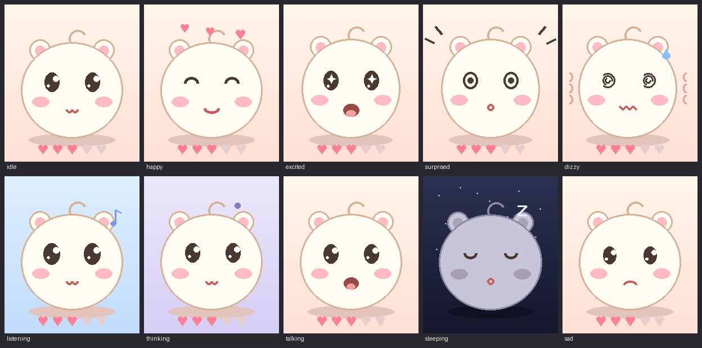

# pi-gottchi 「もこ」 🐹

Raspberry Pi Zero W + PiSugar Whisplay HAT で動く、**話せる・なでられる・揺れに反応する**たまごっち風AIキャラクター。



- 🗣️ **ハンズフリー連続会話** — 話しかけるだけ。Gemini Live API が音声のまま理解して、可愛い声(Leda)で約3秒で返事
- 🧠 **記憶** — 名前・好きなもの・話題を覚えて、**寝ている間に記憶を整理**。起きても前の話の続きができる
- 🐹 **たまごっち感** — なでると喜ぶ、揺らすとびっくり、放置すると眠る、電池が減ると「おなかすいた」
- 🎨 表情10種の常時アニメーション + 状態表示LED + 吹き出し字幕
- 💰 **ランニングコスト無料** — Gemini API 無料枠のみで全機能が動く
- 🔬 実験機能: **声紋ライト** — 起こした人の声を覚えて一致度を判定(MFCC統計、armv6でも動く)

## ハードウェア

| 部品 | 備考 |
|---|---|
| Raspberry Pi Zero W | armv6 シングルコアでも動くよう最適化(Zero 2 W ならさらに快適) |
| PiSugar Whisplay HAT | 1.69" LCD (ST7789 240×280) + マイク + スピーカー + ボタン + RGB LED |
| PiSugar バッテリー | 残量連動(「おなかすいた」表示・危険残量で自動シャットダウン) |
| 加速度センサー(任意) | MPU6050 / ADXL345 / H3LIS331DL を自動検出。配線は [WIRING.md](app/WIRING.md) |
| サーボ SG90(任意) | ハードウェアPWM(BCM12/13)。将来のしっぽ・耳用 |

## あそびかた

| 操作 | 反応 |
|---|---|
| 話しかける | 起きていればそのまま会話(連続会話モード) |
| ボタン1回押し | なでなで(ハートが飛ぶ) |
| ボタン長押し | おはなし(Live切断時のフォールバック) / 10秒で安全シャットダウン |
| 本体を揺らす | びっくり / 激しいと目がまわる(要・加速度センサー) |
| 放置20秒(夜10秒) | すやすや眠る。ボタン・揺れ・大きめの声で起床 |

## セットアップ

```bash
# 1. 前提: Raspberry Pi OS + Whisplay ドライバ
#    https://github.com/PiSugar/whisplay → install_driver.sh

# 2. 依存パッケージ
sudo apt install python3-numpy python3-pil python3-requests python3-websockets \
                 python3-smbus2 sox alsa-utils
# 任意(TTS最終フォールバック): open-jtalk + 東北f01ボイス

# 3. コード配置
mkdir -p ~/whisplay-moko
cp app/* ~/whisplay-moko/          # コード・serviceファイル一式
cp -r boot_frames ~/whisplay-moko/ # 起動スプラッシュのフレーム

# 4. APIキー(無料枠でOK: https://aistudio.google.com/apikey)
cp app/.env.example ~/whisplay-moko/.env
nano ~/whisplay-moko/.env          # GEMINI_API_KEY を記入
chmod 600 ~/whisplay-moko/.env

# 5. systemd 常駐化(電源ONで自動起動・クラッシュ時3秒で自動復活)
sudo cp ~/whisplay-moko/moko.service /etc/systemd/system/
sudo cp ~/whisplay-moko/moko-splash.service /etc/systemd/system/
sudo systemctl enable --now moko-splash.service moko.service
```

初回起動時のみ反応ボイス(14種)を生成して `voices/` にキャッシュします。以後の反応はオフラインでも鳴ります。

## しくみ

```
マイク(arecord 16kHz) → 0.5秒チャンク → WebSocket → Gemini Live (native-audio)
     ↑ 半二重制御・エコー破棄・声紋判定                │ サーバー側VADが発話を検出
                                                      ↓
スピーカー(aplay) ← 24kHz音声ストリーム ← 音声のまま理解して音声で返答
```

- **接続の頑丈さ**: 無音でもセッションを維持(ping生存確認)、切断時は3秒から指数バックオフで再接続、サーバーの期限予告(goAway)にも対応
- **記憶**: 会話ターンを `memory.json` に記録 → 眠りにつくと Gemini で「名前・好み・約束・話題」を250字に整理統合 → 起床時(再接続時)にシステムプロンプトへ注入
- **声紋ライト**(実験): 起こした人の最初の発話でMFCC統計を登録し、以降のターンで一致度を判定。おやすみでリセット。`VOICEPRINT=gate` で知らない声を聞き流す

### ファイル構成

```
app/
  chara.py         メイン(状態機械・ボタン・描画ループ・気分/睡眠/電池)
  face.py          顔の描画(表情10種・まばたき・ぷにぷに)
  live.py          Gemini Live API 連続会話(WebSocket・半二重・自動再接続)
  voice.py         RESTフォールバック会話 / TTS / 反応ボイスキャッシュ / Open JTalk
  memory.py        記憶(直近会話 + 寝ている間の長期記憶整理)
  voiceprint.py    声紋ライト(MFCC統計 + コサイン類似度)
  imu.py           加速度センサー自動検出 + 揺れ判定
  servo.py         サーボ制御(将来の拡張用)
  splash.py        起動スプラッシュ(「もこ じゅんびちゅう」)
  moko.service     systemd ユニット
  WIRING.md        センサー・サーボ配線ガイド
boot_frames/       スプラッシュのフレーム画像(gen_boot_frames.py で生成)
gen_boot_frames.py スプラッシュフレーム生成ツール(開発PC用)
preview.py         顔デザインのPNGプレビュー(開発PC用)
```

## カスタマイズ

| 変えたいもの | 場所 |
|---|---|
| 性格・口調 | `voice.py` の `SYSTEM_PROMPT` |
| 声 | `live.py` の `VOICE`(Leda→Kore等) / `voice.py` の `TTS_STYLE` |
| 反応セリフ | `voice.py` の `CLIPS`(変更すると次回起動時に再生成) |
| 眠る時間 | `chara.py` の `SLEEP_AFTER` / `NIGHT_SLEEP_AFTER` / `NIGHT` |
| 揺れ感度 | `imu.py` の `LIGHT` / `HARD` |
| 声紋実験 | `.env` の `VOICEPRINT=log/gate/off`、しきい値は `live.py` の `VP_THRESH` |
| モデル | `.env` の `GEMINI_MODEL` / `GEMINI_LIVE_MODEL` / `GEMINI_TTS_MODEL` |

## 運用

```bash
sudo journalctl -u moko -f                   # ライブログ(会話内容も出る)
sudo journalctl -u moko | grep "\[you\]"     # 会話履歴
sudo journalctl -u moko | grep "\[voice\]"   # 声紋一致度
sudo journalctl -u moko | grep "\[memory\]"  # 記憶の整理
sudo systemctl restart moko                  # 再起動
```

> ⚠️ Gemini **無料枠**は入力データがモデル改善に使われる規約です。プライベートな話題には注意。

## 謝辞

- [PiSugar Whisplay HAT](https://docs.pisugar.com/docs/product-wiki/whisplay/overview) とそのドライバ
- 会話・音声: Google Gemini Live API / TTSフォールバック: Open JTalk(東北f01ボイス)
